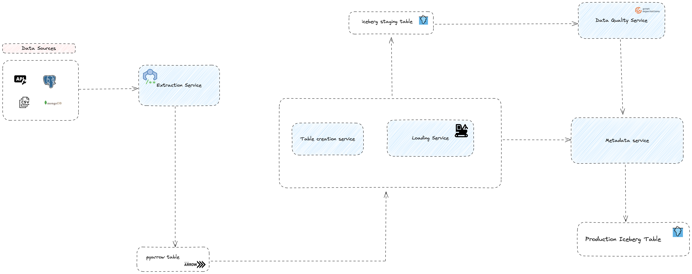

# iceberg-integration-framework

Building a simple end-to-end ingestion framework. This work is inspired by my work on [hacking-apache-iceberg](https://github.com/JesuFemi-O/hacking-apache-iceberg). 

I have created this repo to help me not drift away from my goal of piecing together and easy to follow open-tutorial on getting started with apache iceberg. 

The decisions in the hacking-apache-iceberg repo will directly influnce this work since the framework will be powered by the stack from that repo.

Framework Architecture

So from a framework perspective here's how I'm thinking of approaching the problem.

1. an extraction service: This will simply be a class or group of classes that will be responsible for fetching data from different kind of sources. so think of it as a wrapper that allows for a uniform interface that will unify extraction efforts and always return a pyarrow table 

2. Metadata service: Basically a service that can evaluate the pyarrow table and have enough information to create an iceberg table if the data represents a new source, I dont know if this service is doing too much if its tracking incoming data metadata and also handle table creation but that's food for thoughts. Same idea here about a class or group of classes that form the service - will break this into a metadata and table creation service.

3. Data quality service: this service pretty much ensures that a contract about the structure of the data is respected and adhered to there are many tools for DQ so I'm all about building interfaces to represent the service in a uniform way.

4. Loader service: This plane handles insert if it's a new source and upserts/merge if it's an existing source

All services should be able to communicate with the metadata service and the loader service should be able to verify if a source should be loaded into the production table. 

## How to run

To see my progress so far, create a virtual env and install the requirements then cd into `src` and execute `python testrun.py`

the main script has the core idea per unit time, but then they may not have been tested or completely integrated, the testrun script will hold the most up to date tested pieces.

# Levraging another tool

So after careful consideration of the architecture I highlighted here, it has become pretty clear that I may be largely reinventing the wheel on may grounds. Most of the Stuff I want to achieve with this framework is already done out of the box with an existing framework called [DLT](https://dlthub.com/).

1. The idea that I should have a uniform interface that can ingest data from any kind of source such that the logic of the source can be abstracted away as an implementation detail is already possible through DLT

2. DLT integerates with all the sources I have identified here (relational DB, API, File-like systems like GCS, S3, Local file system, etc)

3. DLT gracefullt handles schema evolution (through a process called normalization & schema contracts)

4. DLT comes with multiple write dispositions (replace, merge, append) whcih means it can handle incremental loads

5. DLT can handle backfills

6. DLT supports apache Iceberg tables via it's Athena and Dremio destinations

7. If you have a destination in mind not yet officially supported, DLT can be extended to build your own custom destination

8. Becasue DLT is pythonic and open source, it's a great choice for technical maintainers as they can extend it to build custom source and destinations. It's also great for non-technical folks because once a source or destination exists it's fairly easy to run dlt

### Building a cusstom Iceberg destination

So this piece isn't 100% figured out at this point but basically a generic custom destination that supports catalogs like REST, Hive Metadata catalog, nessie, etc. would be great.

I've been thinking about what the destination should look like and in theory I guess the idea would be to implement an interface that let's dlt:

1. Figiure out what catalog it needs to talk to
2. check that the metadata (data schema, table name, etc) it has about incoming data can somehow be verified against the catalog
3. create a table with required information if it doesn't exist
4. perform DML operations on an existing table based on the state data, write disposiiton, etc.

If I can implement a destination that can somehow enable dlt to perform all these operations I think I'd have created a truly generic iceberg destination. There's also the trouble of figuring out what mechnism to use to talk to iceberg and it's catalog because pyiceberg is currently limited in what it's capable of doing as I've highlighted in previous sections of this doc.
