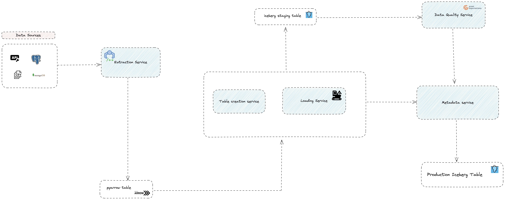

# Building a custom ELT integration framework

Framework Architecture

So from a framework perspective here's how I'm thinking of approaching the problem.

1. an extraction service: This will simply be a class or group of classes that will be responsible for fetching data from different kind of sources. so think of it as a wrapper that allows for a uniform interface that will unify extraction efforts and always return a pyarrow table 

2. Metadata service: Basically a service that can evaluate the pyarrow table and have enough information to create an iceberg table if the data represents a new source, I dont know if this service is doing too much if its tracking incoming data metadata and also handle table creation but that's food for thoughts. Same idea here about a class or group of classes that form the service - will break this into a metadata and table creation service.

3. Data quality service: this service pretty much ensures that a contract about the structure of the data is respected and adhered to there are many tools for DQ so I'm all about building interfaces to represent the service in a uniform way.

4. Loader service: This plane handles insert if it's a new source and upserts/merge if it's an existing source

All services should be able to communicate with the metadata service and the loader service should be able to verify if a source should be loaded into the production table.