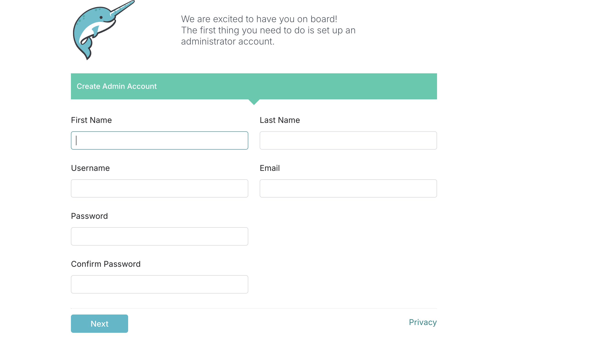
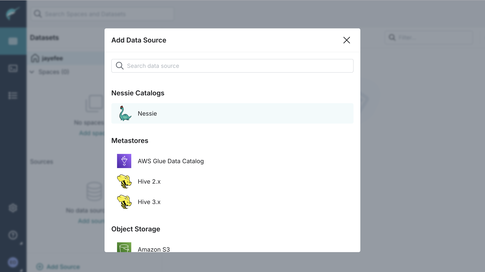
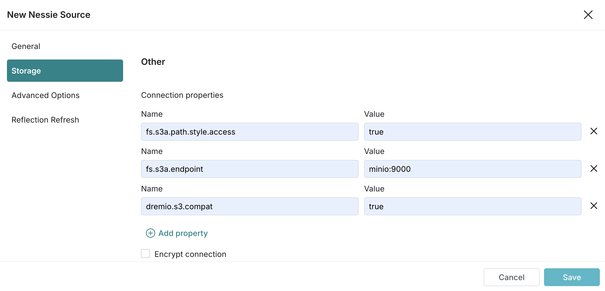

# Building an ETL Integration stack with DLT and Dremio


This version of my project adopts dlthub for data ingestion and loading into my iceberg tables.

rather building a common interface for sources I'm leveraging as much as possible a single tool. which would handle extraction, normalization, schema evolution, and loading into my datalake.

## Setting up The stack

notes about how to connect minio and nessie to dremio.
1. create and activate a virutal environment in the root directory of your project

2. cd into `src/src_v2` and start up the compose file:
```bash
docker-compose up -d
```

3. once you've confirmed that all services are running, open dremio on your web browser at `http:localhost:9047` and sign-up. take note of your username and password as they'll be needed by dlt



4. click on sources after sign-in and select nessie catalog


5. add the following settings
    in the general tab
        - nessie endpoint url: http://nessie:19120/api/v2
        - nessie authentication type: None
    
    in the storage tab:
        - aws root path: warehouse
        - aws access key: minioadmin
        - aws secret ket: minioadmin
    in the same storage tab, just below, add the following properties and ensure you uncheck the encrypt connection option

    

6. click save and that should add your nessie catalog as a source to dremio

7. add minio - since mino is an s3 compatable source you can add it as follows:
[add-s3](../../docs/assets/add-s3-source.png)

8. add the following settings
    in the general tab:
        - name: s3_buckets
        - aws access key: minioadmin
        - aws secret ket: minioadmin
        - ensure that you uncheck the encypt connection option
    
    in the advanced option tab:
    - check the `Enable compatibility mode` option
    - fs.s3a.path.style.access: true
    - fs.s3a.endpoint: minio:9000

9. the last two options should be added under connection properties
[s3-connection](../../docs/assets/s3-connection-properties.png)


10. click on save and the minio bucket should show up like in the image:
[s3-view](../../docs/assets/bucket-views.png)


## configuring DLT


1. add a secrets.toml file to the .dlt folder

```
[destination.filesystem]
bucket_url = "s3://landing" # replace with your bucket name,

[destination.filesystem.credentials]
aws_access_key_id = "minioadmin"
aws_secret_access_key = "minioadmin"
endpoint_url = "http://localhost:9000"

[destination.dremio]
staging_data_source = "s3_buckets" 

[destination.dremio.credentials]
database = "nessie" # can change to anything you name your catalog integration in dremio
password = "<ENTER PASSWORD>"
username = "<ENTER USERNAME>"
host = "localhost"
port = 32010
```

- The bucket url is what dlt uses to determine where files should be staged in your object storage before writing them into iceberg tables.

- Because we are using minio in place of s3 you need to specify the endpoint_url

- The database is set to nessie because that's what we called our nessie connection in dremio and we want dlt to create the iceberg tables with the nessie catalog.

- staging_data_source is set to s3_buckets since dlt needs to know what source in dremio represents our object storage. dlt will use this information when generating queries that will be used to load the data into our iceberg tables.

- the username and password you configured while signing up to dremio should be provided in the `destination.dremio.credentials` section in secrets.toml


# Running DLT

- in your src_v2 directory, run `python main.py` to start the loading.

you should get a message like the one in the image if the load is successful

[dlt-run-success](../../docs/assets/successful-run.png)

The tables should also show up in iceberg/nessie:

[iceberg-tables](../../docs/assets/iceberg-tables.png)

and you should be able to query the data

[iceberg-query](../../docs/assets/query-iceberg.png)


notes about how to configure your secrets.toml file and install the requirements.txt